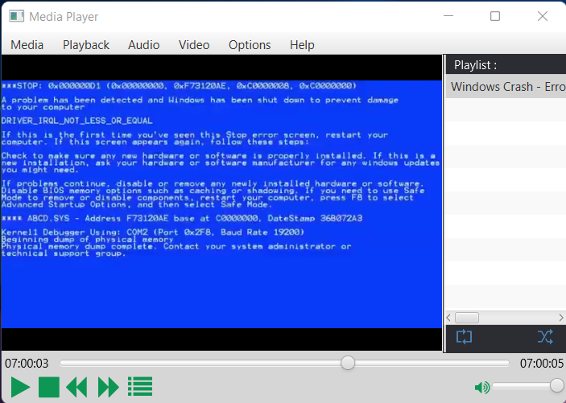
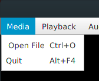
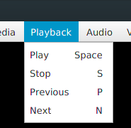
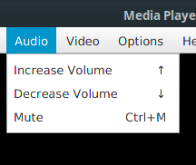
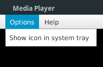

#  Description
Аудиоплеер с клиентской и серверной частью. На клиенте реализуется пользовательский интерфейс в виде списка аудиозаписей, загруженных из базы данных, и панель управления воспроизведением с кнопками «старт/пауза», «стоп», «следующий трек», «предыдущий трек».
На серверной части будет размещена база данных со списком аудиозаписей. Задача сервера – отправить требуемый аудиофайл клиенту по запросу.

## Screenshots 
  
 
 
 
 

## Target
Основной целью является реализация минимального объёма работ, включающего в себя следующие объекты:  
1.	Пользовательский интерфейс (клиент)  
	1.1.	Список аудиозаписей – создается список с последовательными запросами.  
	1.2.	Панель управления – осуществляет управление воспроизведением текущих медиафайлов. Кнопки «старт/пауза», «стоп», «следующий трек», «предыдущий трек».  
2.	Приложение  
	2.1.	Классы – Описывают все необходимые функции для работы с медиафайлами  
	2.2.	Библиотеки – Дополненительные материалы для работы с медафайлами на java и улучшения шрифта.  

## Plan 
21.11.2022-04.12.2022:	Создание основы для работы с медиафайлами на java
05.12.2022-18.12.2022:	Создание графического интерфейса через javafx
19.12.2022-25.12.2022:	Доработка Desktop приложения на java

## Supported format
- Audio : mp3 , wav , aif  
- Viedo : mp4 , flv  

## Credits
•	Инструмент разработки – IntelliJ IDEA  
•	Язык программирования – Java.  
•	Среда разработки интерфейса – SceneBuilder.  

## Authors
Чикулаев Владислав Алексеевич - _M3RL1N_  
Кушнир Никита Анатольевич - barsiqe   
Тимофеев Кирилл Александрович - its_clicking  